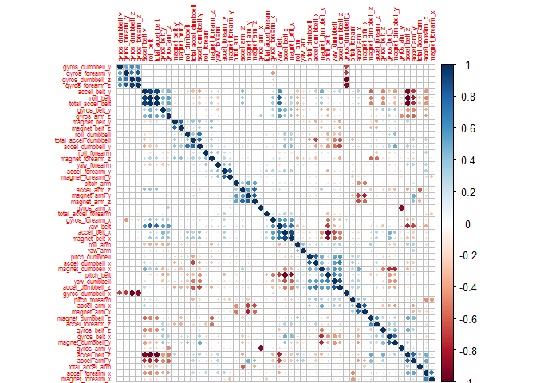
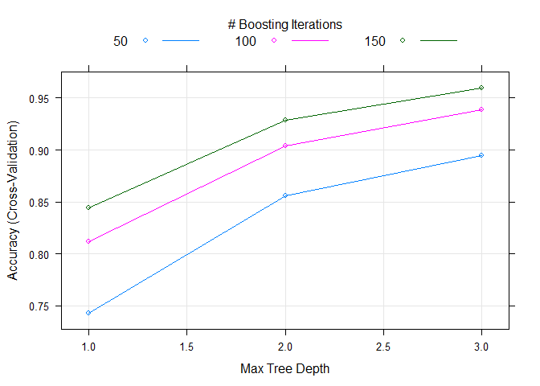
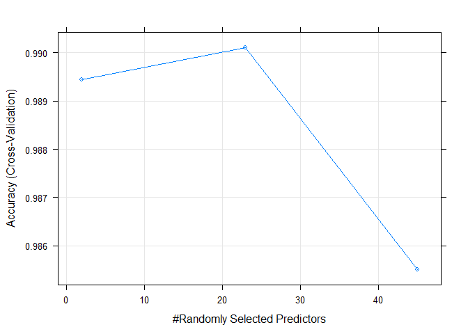
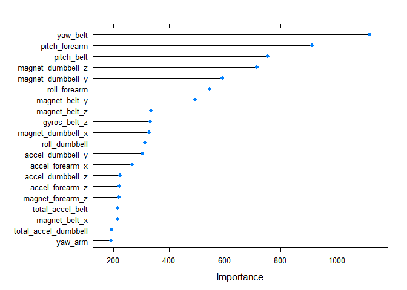

# Human Activity Recognition Model

# Summary

The goal is to use data from accelerometers placed on the belt, forearm, arm, and dumbell of six participants to predict how well they were doing the exercise.
Five different exercise classifications are considered, "Exactly according to the specification (Class A), throwing the elbows to the front (Class B), lifting the dumbbell only halfway (Class C), lowering the dumbbell only halfway (Class D) and throwing the hips to the front (Class E).

The purpose of this report is to describe the process and result for building a model to predict the classification of the correctness of an individual exercise.

For more information see [http://groupware.les.inf.puc-rio.br/har]( http://groupware.les.inf.puc-rio.br/har) .

# Load Data

The data used are :

* Training set [https://d396qusza40orc.cloudfront.net/predmachlearn/pml-training.csv](https://d396qusza40orc.cloudfront.net/predmachlearn/pml-training.csv), this data is used to build the model.

* Testing set [https://d396qusza40orc.cloudfront.net/predmachlearn/pml-testing.csv](https://d396qusza40orc.cloudfront.net/predmachlearn/pml-testing.csv), this data is used for the submit ot automatic grader. 

We load training and testing data sets by converting empty and #DIV/0! values as missing values.


```r
library(caret)
library(corrplot)
library(kernlab)
library(randomForest)

set.seed(12345)

train.url <- "https://d396qusza40orc.cloudfront.net/predmachlearn/pml-training.csv"
test.url <- "https://d396qusza40orc.cloudfront.net/predmachlearn/pml-testing.csv"
file.train <- "pml-training.csv"
file.test <- "pml-testing.csv"

if (!file.exists(file.train)){
    download.file(train.url, file.train)
}
if (!file.exists(file.test)){
    download.file(test.url, file.test)
}

pml.train <- read.csv(file.train, na.strings=c("NA","","#DIV/0!"), header=TRUE)
pml.test <- read.csv(file.test, na.strings=c("NA","","#DIV/0!"), header=TRUE)
```


# Explore Data

We explore data from the train data set.

```r
# dimension
dim(pml.train)
```

```
## [1] 19622   160
```

```r
# summary of the classes variable (levels).
summary(pml.train$classe)
```

```
##    A    B    C    D    E 
## 5580 3797 3422 3216 3607
```

```r
# NA variables count for each columns combination.
table(colSums(is.na(pml.train)))
```

```
## 
##     0 19216 19217 19218 19220 19221 19225 19226 19227 19248 19293 19294 
##    60    67     1     1     1     4     1     4     2     2     1     1 
## 19296 19299 19300 19301 19622 
##     2     1     4     2     6
```
The training data have ``19622`` records with ``160`` variables. 
The outcome variable ***classe*** has ``5`` factors levels.


# Filter Data

We filter the training data :

* Remove variables with 80% missing  values.

* Remove near zero covariates

* Remove the columns that aren't the predictor variables ("X", "user_name", "raw_timestamp_part_1", "raw_timestamp_part_2", "cvtd_timestamp", "new_window", "num_window")

* Remove high correlated variables > 0.9.


```r
# Remove variables with 80% Missing values 
selected.columns <- colSums(is.na(pml.train)) <  0.8 *nrow(pml.train)
pml.train <- pml.train[,selected.columns]  
#Remove near zero covariates
nsv <- nearZeroVar(pml.train, saveMetrics = T)
pml.train <- pml.train[, !nsv$nzv]
#Remove the columns that aren't the predictor variables 
pml.train <- pml.train[, -which(colnames(pml.train) %in% c("X", "user_name", "raw_timestamp_part_1", "raw_timestamp_part_2", 
              "cvtd_timestamp", "new_window", "num_window"))]
```


Plot variables correlation, then remove high correlated variables.

```r
cor.data <- cor(subset(pml.train, select=-c(classe)))
corrplot(cor.data, order="hclust", tl.cex=0.5)
```

 

```r
removecor = findCorrelation(cor.data, cutoff = .90, verbose = F)
pml.train = pml.train[,-removecor]
```


After filtering, the training data set has ``13737`` samples and ``46`` variables.

# Build model

## Partition Data

The data set ***pml.train*** is split into training and testing sets in a 70/30 ratio to train the model and then test it against testing data set.


```r
partition <- createDataPartition(y = pml.train$classe, p = 0.7, list = FALSE)
training <- pml.train[partition, ]
testing <-  pml.train[-partition, ]
```


We build the prediction models on the training data.  
We try two models : Booting Model, Random Forest.
Parameters will be tuned via 4-fold cross validation.

## Boosting model

Use the boosting model with a 4-fold cross validation to predict **classe** with all other predictors.


```r
boostModel <- train(classe ~ ., method = "gbm", data = training, preProcess=c("center", "scale"), verbose = F, trControl = trainControl(method = "cv", number = 4))
print(boostModel)
```

```
## Stochastic Gradient Boosting 
## 
## 13737 samples
##    45 predictor
##     5 classes: 'A', 'B', 'C', 'D', 'E' 
## 
## Pre-processing: centered, scaled 
## Resampling: Cross-Validated (4 fold) 
## 
## Summary of sample sizes: 10301, 10303, 10304, 10303 
## 
## Resampling results across tuning parameters:
## 
##   interaction.depth  n.trees  Accuracy  Kappa  Accuracy SD  Kappa SD
##   1                   50      0.7       0.7    0.008        0.010   
##   1                  100      0.8       0.8    0.004        0.005   
##   1                  150      0.8       0.8    0.006        0.007   
##   2                   50      0.9       0.8    0.004        0.005   
##   2                  100      0.9       0.9    0.001        0.002   
##   2                  150      0.9       0.9    0.002        0.002   
##   3                   50      0.9       0.9    0.006        0.008   
##   3                  100      0.9       0.9    0.003        0.004   
##   3                  150      1.0       0.9    0.003        0.003   
## 
## Tuning parameter 'shrinkage' was held constant at a value of 0.1
## Accuracy was used to select the optimal model using  the largest value.
## The final values used for the model were n.trees = 150,
##  interaction.depth = 3 and shrinkage = 0.1.
```


### Boosting model evaluation with testing data set

```r
prediction.boost <- predict(boostModel,testing)
confusion.boost <- confusionMatrix(prediction.boost,testing$classe)
confusion.boost
```

```
## Confusion Matrix and Statistics
## 
##           Reference
## Prediction    A    B    C    D    E
##          A 1652   41    0    1    2
##          B   12 1059   44    5   13
##          C    6   35  964   37    6
##          D    4    3   18  914   19
##          E    0    1    0    7 1042
## 
## Overall Statistics
##                                         
##                Accuracy : 0.957         
##                  95% CI : (0.951, 0.962)
##     No Information Rate : 0.284         
##     P-Value [Acc > NIR] : < 2e-16       
##                                         
##                   Kappa : 0.945         
##  Mcnemar's Test P-Value : 2.46e-08      
## 
## Statistics by Class:
## 
##                      Class: A Class: B Class: C Class: D Class: E
## Sensitivity             0.987    0.930    0.940    0.948    0.963
## Specificity             0.990    0.984    0.983    0.991    0.998
## Pos Pred Value          0.974    0.935    0.920    0.954    0.992
## Neg Pred Value          0.995    0.983    0.987    0.990    0.992
## Prevalence              0.284    0.194    0.174    0.164    0.184
## Detection Rate          0.281    0.180    0.164    0.155    0.177
## Detection Prevalence    0.288    0.193    0.178    0.163    0.178
## Balanced Accuracy       0.988    0.957    0.961    0.970    0.981
```

The accuracy of the model is ``0.96``.
The accuracy against the testing data set is ``0.957``.


Plot the accuracy of the boost model.

```r
plot(boostModel)
```

 

##Random forests model

Use the Random forests model with a 4 fold cross validation to predict **classe** with all other predictors.


```r
rfModel <- train(classe ~ .,  method="rf",  data=training, preProcess=c("center", "scale"), trControl=trainControl(method = "cv", number = 4))
print(rfModel)
```

```
## Random Forest 
## 
## 13737 samples
##    45 predictor
##     5 classes: 'A', 'B', 'C', 'D', 'E' 
## 
## Pre-processing: centered, scaled 
## Resampling: Cross-Validated (4 fold) 
## 
## Summary of sample sizes: 10304, 10303, 10302, 10302 
## 
## Resampling results across tuning parameters:
## 
##   mtry  Accuracy  Kappa  Accuracy SD  Kappa SD
##    2    1         1      0.002        0.003   
##   23    1         1      0.002        0.003   
##   45    1         1      0.003        0.004   
## 
## Accuracy was used to select the optimal model using  the largest value.
## The final value used for the model was mtry = 23.
```


### Random forests evaluation testing data set

```r
prediction.rf <- predict(rfModel,testing)
confusion.rf <- confusionMatrix(prediction.rf,testing$classe)
confusion.rf
```

```
## Confusion Matrix and Statistics
## 
##           Reference
## Prediction    A    B    C    D    E
##          A 1671    9    0    0    0
##          B    3 1127    6    0    0
##          C    0    3 1016   11    1
##          D    0    0    4  952    5
##          E    0    0    0    1 1076
## 
## Overall Statistics
##                                        
##                Accuracy : 0.993        
##                  95% CI : (0.99, 0.995)
##     No Information Rate : 0.284        
##     P-Value [Acc > NIR] : <2e-16       
##                                        
##                   Kappa : 0.991        
##  Mcnemar's Test P-Value : NA           
## 
## Statistics by Class:
## 
##                      Class: A Class: B Class: C Class: D Class: E
## Sensitivity             0.998    0.989    0.990    0.988    0.994
## Specificity             0.998    0.998    0.997    0.998    1.000
## Pos Pred Value          0.995    0.992    0.985    0.991    0.999
## Neg Pred Value          0.999    0.997    0.998    0.998    0.999
## Prevalence              0.284    0.194    0.174    0.164    0.184
## Detection Rate          0.284    0.192    0.173    0.162    0.183
## Detection Prevalence    0.285    0.193    0.175    0.163    0.183
## Balanced Accuracy       0.998    0.994    0.994    0.993    0.997
```

The accuracy of the model is ``0.99``.
The accuracy against the testing data set is ``0.993``.


Plot the accuracy of the Random forests model.

```r
plot(rfModel)
```

 


# Conclusion (Accuracy, Out of sample error)

The accuracies for both model are :

 * Boost model accuracy : ``0.957`` (Out of sample error is ``0.043``).
 
 * Random Forest model accuracy : ``0.993`` (Out of sample error is ``0.007``).

The random forest has better accuracy the the boosting model. So we use it to predict the Test data set.

The final Ramdom forest model

```r
rfModel$finalModel
```

```
## 
## Call:
##  randomForest(x = x, y = y, mtry = param$mtry) 
##                Type of random forest: classification
##                      Number of trees: 500
## No. of variables tried at each split: 23
## 
##         OOB estimate of  error rate: 0.69%
## Confusion matrix:
##      A    B    C    D    E class.error
## A 3901    3    1    0    1    0.001280
## B   20 2631    7    0    0    0.010158
## C    0   18 2368   10    0    0.011686
## D    0    0   20 2228    4    0.010657
## E    0    1    3    7 2514    0.004356
```

The most important predictors are :

```r
#importance(model$finalModel)
plot(varImp(rfModel, scale=FALSE), top=20)
```

 


#Predict the test set

Predict the test data set with the random forest model.


```r
test.prediction <- predict(rfModel, pml.test)
test.prediction
```

```
##  [1] B A B A A E D B A A B C B A E E A B B B
## Levels: A B C D E
```


Write the predicted results.


```r
  dir.create("result", showWarnings = FALSE)
  pml_write_files = function(x){
    n = length(x)
    for(i in 1:n){
      filename = paste0("result/problem_id_",i,".txt")
      write.table(x[i],file=filename,quote=FALSE,row.names=FALSE,col.names=FALSE)
    }
  }
  
  pml_write_files(test.prediction)
```

